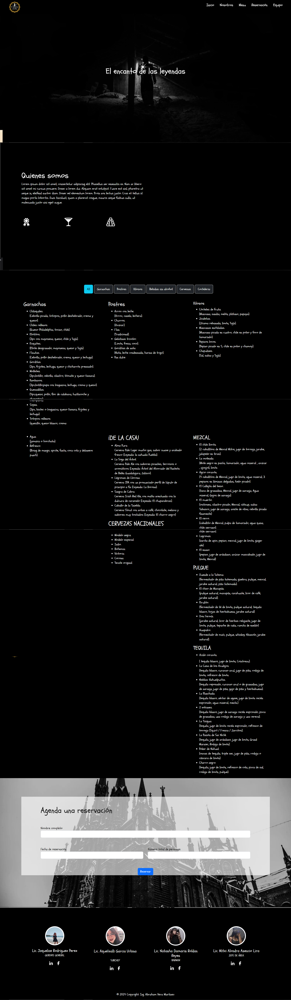

# El Encanto de las Leyendas - Landing Page

## Descripción

El Encanto de las Leyendas es una landing page diseñada para un restaurante con temática de leyendas mexicanas. La página incluye:

<ul>
    <li>nicio: Una sección de bienvenida.</li>
    <li>Quienes Somos: Información sobre el restaurante.</li>
    <li>Menú: Un filtro interactivo para mostrar diferentes platillos.</li>
    <li>Reservaciones: Un formulario para que los clientes puedan hacer reservaciones.</li>
    <li>Equipo: Una sección dedicada al equipo del restaurante.</li>
</ul>

## Pruebas de la Landing Page

## Tecnología Utilizada

Esta landing page fue desarrollada utilizando el framework Astro, como una práctica para familiarizarse con sus características y capacidades.

## Objetivos del Proyecto

<ul>
    <li>Crear una página optimizada para diversas funciones.</li>
    <li>Mejorar la interacción y experiencia del usuario.</li>
    <li>Proporcionar una interfaz atractiva y fácil de usar.</li>
</ul>

## Instalación y Uso

<ul>
    <li>Clonar el repositorio: 
    <pre><code>git clone https://github.com/tu-usuario/el-encanto-de-las-leyendas.git</code></pre></li>
    <li>Instalar las dependencias: 
    <pre><code>cd el-encanto-de-las-leyendas 
    npm install</code></pre></li>
    <li>Iniciar el servidor de desarrollo: 
    <pre><code>npm run dev</code></pre></li>
    <li>Abrir el navegador:</li>
    <li>Visita http://localhost:3000 para ver la landing page en acción.</li>
</ul>

## Contribución

Las contribuciones son bienvenidas. Por favor, sigue estos pasos:

<ul>
    <li>Haz un fork del proyecto.</li>
    <li>Crea una rama nueva (git checkout -b feature/nueva-caracteristica).</li>
    <li>Realiza tus cambios y haz commit (git commit -m 'Agregar nueva característica').</li>
    <li>Sube tus cambios (git push origin feature/nueva-caracteristica).</li>
    <li>Abre un Pull Request.</li>
</ul>